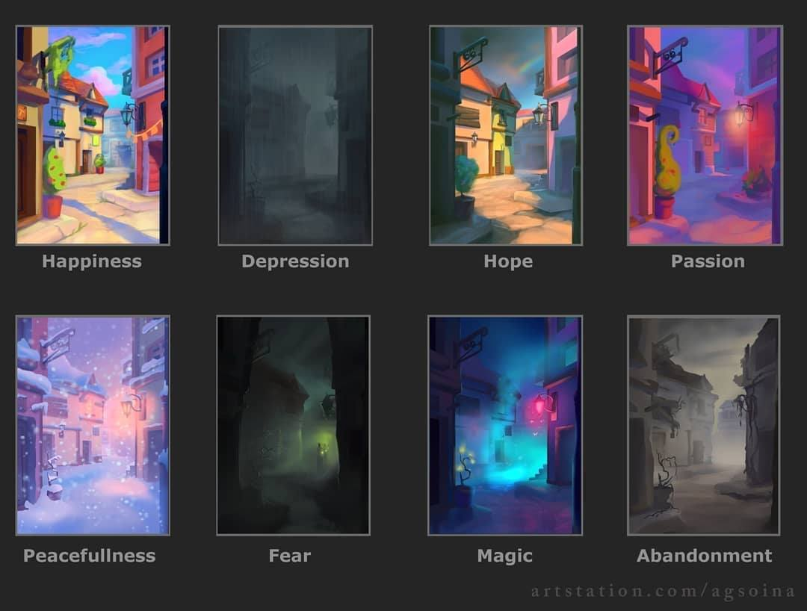

# Placeholder Name VAE GAN

## What is this repository?

This is an experimental neural network used to style transfer using a VAE GAN network.

## Data acquisition

All images were downloaded from google image search using [Download all images extension for chrome](https://chrome.google.com/webstore/detail/download-all-images/ifipmflagepipjokmbdecpmjbibjnakm?hl=en)

All copyrights belong to the respective content creators

|class| instances |
|------|--------------|
|abandonment |744|
|depression |760|
|fear| 767|
|happiness |782|
|hope|737|
|magic |766|
|passion |666|
|peacefulness |592|

`1.21 GB` under JPEG compression

## Model Architecture

*PENDING*

## Results

*PENDING*